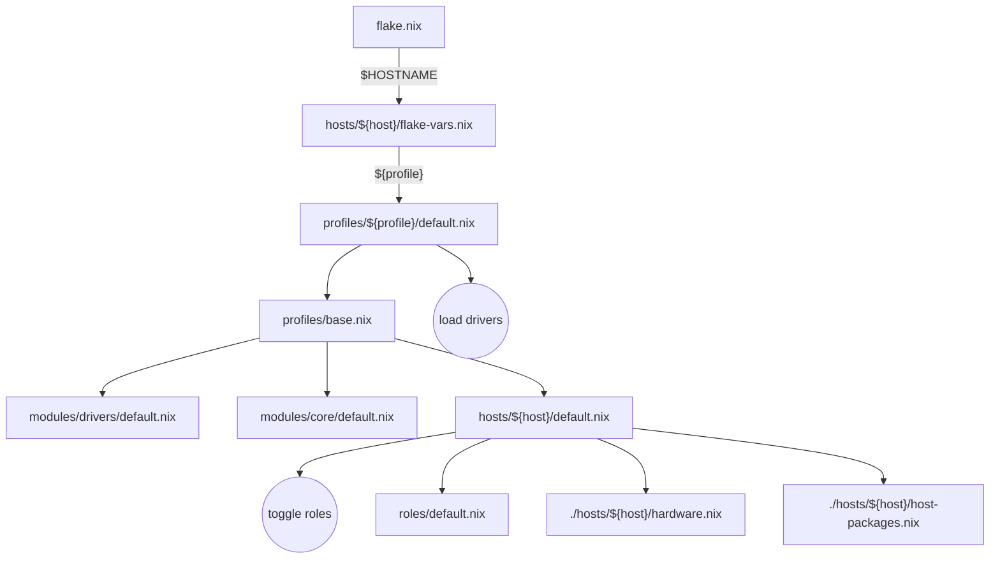

# nixos


This repository contains the definition of my machines as code (i.e. declarative
setup) using NixOS. It is structured as follows:

<details>
<summary>GIF preview</summary>


</details>

## Structure

- `dev-shells`: ready-to-use development shell for various languages.
- `hosts`: the different machines and their specific configuration values.
- `modules`: common software and service configurations.
  - `core`: common NixOS modules.
  - `home`: home-manager modules (i.e. nix-based dotfiles).
  - `drivers`: hardware drivers (imported by profiles).
- `packages`: custom packages defined in this repository.
- `roles`: groups of modules, packages and configurations that can be enabled independently.
- `profiles`: hardware profiles (imported by hosts).

This configuration and the setup script are derived from
[zaneyOS](https://gitlab.com/Zaney/zaneyos).

It uses a flake-based nixos config.

The flake outputs are as follows, exposing one configuration per host in `./hosts`, and custom packages defined in `./packages/`:
```
├───nixosConfigurations
│   ├───apis: NixOS configuration
│   ├───bombyx: NixOS configuration
│   ├───default: NixOS configuration
│   ├───dynastes: NixOS configuration
│   ├───elimus: NixOS configuration
│   └───zaneyos-23-vm: NixOS configuration
└───packages
    ├───aarch64-darwin
    │   ├───antigravity-jail: package 'antigravity-jail-1.0.0'
    │   └───stremio-enhanced: package 'stremio-enhanced-1.0.2'
    └───x86_64-linux
        ├───antigravity-jail: package 'antigravity-jail-1.0.0'
        └───stremio-enhanced: package 'stremio-enhanced-1.0.2'
```

How it works:



* Build with `nh os switch` or `nixos-rebuild switch --flake ".#${HOSTNAME}"`
  + `nh` automatically picks the profile named like `$HOSTNAME` by default
* `flake.nix` reads host configurations from `./hosts/*/flake-vars.nix`
* The host configuration field `profile` is used to load a specific hardware profile.
* The hardware profile enables specific drivers and imports `./profiles/base.nix` which imports the rest of the system (drivers, modules, roles, host).
* The host `./hosts/$HOSTNAME/default.nix` defines hardware configuration and toggle roles.


## Bootstrap

To set up a new machine, use:

```bash
nix-shell -p git
mkdir -p ~/.config/
cd ~/.config
git clone https://github.com/cmdoret/nixos
cd nixos
bash ./setup.sh
```

## Usage

Helpful aliases to manage the configuration are defined in
`modules/home/zsh/default.nix`:

- `fr`: rebuild the system.
- `fu`: updates the system.
- `ncg`: garbage-collect previous generations.
- `dev`: enter a specific dev-shell by profile name (e.g. `dev python.uv`)
